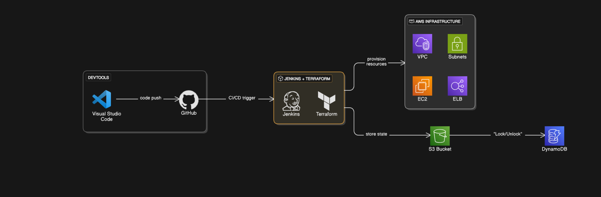

## 📌 Overview

This project demonstrates a CI/CD pipeline for provisioning AWS infrastructure using Jenkins and Terraform. The workflow enables automated deployment of AWS resources (like VPCs, EC2, ELB, and Subnets) triggered by a code push to a GitHub repository.

## 🧰 Tools & Technologies

* **Visual Studio Code:** Code editor for developing Terraform scripts.
* **GitHub:** Source code repository and version control.
* **Jenkins:** CI/CD automation server for running Terraform jobs.
* **Terraform:** Infrastructure as Code (IaC) tool for AWS provisioning.
* **AWS:** Cloud infrastructure provider.
* **S3:** Remote backend for storing Terraform state files.
* **DynamoDB:** State locking and consistency for Terraform.
* **EC2, ELB, VPC, Subnets:** Target infrastructure resources.

## 🔁 Workflow

1.  **Development:** Infrastructure code is written using Visual Studio Code.
2.  **Version Control:** Code is pushed to GitHub.
3.  **CI/CD Trigger:** GitHub triggers Jenkins via webhook or polling.
4.  **Terraform Execution:**
    * Jenkins executes Terraform commands (`init`, `plan`, `apply`).
    * State is stored in an S3 bucket.
    * DynamoDB handles locking/unlocking the state file to prevent race conditions.
5.  **Provisioning:** AWS infrastructure (VPC, EC2, ELB, Subnets) is provisioned or updated accordingly.

   
